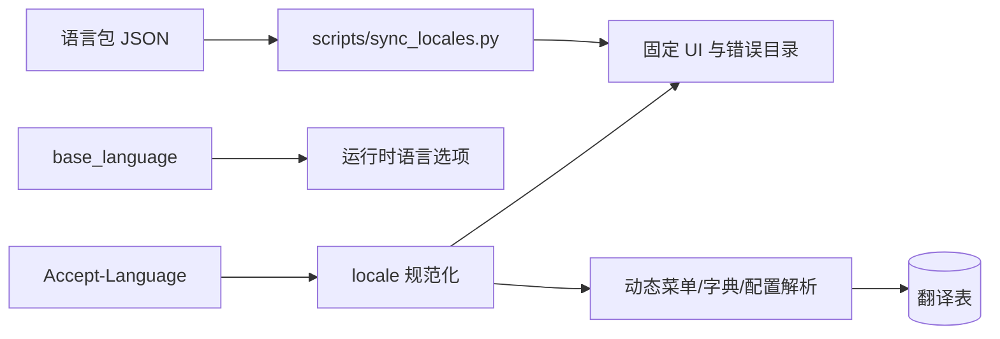

# 国际化设计

本文描述仓库当前已经实现的国际化边界、运行时行为和数据职责。新增语言的具体操作以[国际化语言扩展指南](国际化语言扩展指南.md)为准。

## 当前结论

| 内容 | 当前实现 |
| --- | --- |
| 固定语言包 | `zh-CN`、`zh-TW`、`en-US`、`ja-JP` |
| 编译期默认语言 | `zh-CN` |
| 动态资源主语言 | 由 `base_language.is_primary` 决定 |
| 固定文案 | 三个前端 workspace 的 core/System JSON 语言包 |
| 后端错误 | `backend/internal/i18n/assets` 的结构化 JSON 目录 |
| 运行时语言选项 | `base_language` 接口返回的已启用语言 |
| 动态资源 | 菜单、字典、字典项和系统配置名称/值翻译表 |
| 机器翻译 | 可按需生成并保存空缺译文；已有非空译文不会覆盖 |

国际化不是把语言名称或翻译常量全部放进数据库。数据库负责部署配置，语言包负责编译期白名单和固定文案；新增语言必须同时更新两层。

## 运行时链路



### 编译期语言集合

`scripts/sync_locales.py` 扫描以下七个语言包目录；代码生成器文案也统一存放在后端语言目录，并通过 `system.code.gen.*` 前缀校验：

```text
backend/internal/i18n/assets
frontend/admin/packages/core/src/locales
frontend/admin/packages/modules/system/src/locales
frontend/uni-app/packages/core/src/locales
frontend/uni-app/packages/modules/system/src/locales
frontend/taro-app/packages/core/src/locales
frontend/taro-app/packages/modules/system/src/locales
```

七个语言包目录的文件集合、固定 key 和占位符必须一致；后端语言文件中的 `system.code.gen.*` 键由代码生成器直接复用。脚本生成六个前端 `generated.ts`，并校验管理端 Day.js 和 Element Plus 的 locale 映射。Core 的 `resource/i18n` 接收宿主语言资源，Core 内部负责目录加载和错误本地化，不嵌入项目词条。生成文件不能手工修改。

### 运行期语言配置

`base_language` 保存：

- `language_code`：规范的 BCP 47 语言代码；
- `language_name`、`native_name`：管理端和登录页展示名称；
- `status`、`sort`：是否可选及展示顺序；
- `is_primary`：动态菜单、字典和系统配置的主语言。

前端启动时先使用编译期包建立回退语言列表，再请求公共语言接口；数据库接口成功时以已启用语言和排序为准，失败时回退编译期语言列表。部署配置应只启用已经随包发布的语言，数据库记录本身不会生成缺失的语言包。

### 请求和回退

管理端 Axios、刷新令牌、fetch、SSE 和 Swagger 请求，以及 uni-app/Taro 的请求、上传和 SSE，统一发送规范化的 `Accept-Language`。后端按白名单匹配区域，未知值回退 `zh-CN`。

回退顺序如下：

```text
固定 UI：当前语言 -> zh-CN -> 安全默认文案
菜单/字典/配置：当前语言非空翻译 -> 主表主语言字段 -> 稳定 code/path
错误：当前语言 message_key -> zh-CN message_key -> 原始安全消息 -> INTERNAL_ERROR
```

运行时不展示裸 key、未保存的机器翻译结果、数据库错误、SQL 或第三方 provider 响应。

## 固定文案和错误目录

每个前端模块维护自己的 JSON 语言包，模块注册时校验语言集合、key、命名空间和占位符。core 维护通用能力，System 维护系统管理、个人中心和 AI 文案；模块不得直接修改另一个模块的语言包。

后端错误目录由 `kratos-core/resource/i18n` 加载。Proto `buf.validate` 的 `id/message` 和 Go 中显式的 `WithMessageKey` 必须在 `zh-CN.json` 定义，其他语言保持相同 key 和占位符。检查命令为：

```bash
make i18n-check
```

错误对外保持现有 `code/reason`，只在 metadata 中补充稳定的 `message_key/message_args`，由响应边界按请求语言渲染 `message`。

## 前后端 Key 命名规范

前后端使用同一套分层思想，但保留各自代码生态的命名来源：前端固定文案从组件名生成业务路径，后端错误从 Proto package 和 Service 生成业务路径。Key 是稳定的技术标识，不放中文，不根据翻译结果命名。

### 前端固定文案

前端固定文案使用以下格式：

```text
<模块>.<组件业务路径>.<文案类型>.<名称>
```

组件业务路径来自 `defineOptions.name`，将 PascalCase 名称拆成小写点号路径：

```text
BaseDict      -> base.dict
BaseDictItem  -> base.dict.item
CodeGenTable  -> code.gen.table
BaseTenant    -> base.tenant
```

示例：

```text
system.base.dict.title.create
system.base.dict.field.created_at
system.base.dict.dialog.confirm_status
system.base.dict.message.create_success
system.code.gen.table.field.page_type
```

文案类型使用固定集合：`title`、`field`、`section`、`action`、`placeholder`、`validation`、`dialog`、`message`、`error`、`status`、`value`、`tooltip`、`empty`。名称和字段统一使用 `snake_case`，例如 `confirm_status`、`created_at`、`create_success`。

真正跨业务复用的文案使用 `common.*`，不重复加业务路径：

```text
common.action.create
common.field.created_at
common.validation.required_input
```

前端语言包的逻辑 key 使用上述点号路径。当前运行时和校验代码仍按扁平 key 读取；若将 JSON 改为嵌套对象，必须同步修改同步脚本、模块注册和生成产物，不能只手工改 JSON 外形。

### 后端错误消息

后端 `message_key` 使用以下格式：

```text
<package 去掉版本>.<Service 业务路径>.<操作或对象>.<字段>.<规则>
```

Proto package 去掉版本号，Service 去掉 `Service` 后按 PascalCase 拆成小写点号路径：

```text
system.admin.v1 + BaseDictService -> system.admin.base.dict
system.admin.v1 + CodeGenTableService -> system.admin.code.gen.table
base.v1 + LoginService -> base.login
```

示例：

```text
system.admin.base.dict.entity.name.required
system.admin.base.dict.create.name.required
system.admin.base.dict.update.id.required
system.admin.code.gen.table.field.page_type.required
```

`entity` 表示实体本身的校验，其他值表示具体操作。字段名和规则名使用 Proto 风格的 `snake_case`。规则名称应保持稳定，优先使用 `required`、`max_length`、`min_length`、`format`、`pattern`、`positive`、`non_negative`、`unique`、`supported` 等固定词汇。

通用错误不绑定具体 Service：

```text
common.error.invalid_argument
common.error.permission_denied
```

版本号 `v1` 不进入 key；`message_key` 会随错误响应返回，是对外稳定契约，重命名必须同步 Proto、Go、全部语言目录和调用方。

### 前后端对应关系

前后端不要求使用完全相同的 key，但业务路径应能相互对应：

```text
前端：system.base.dict.dialog.confirm_status
后端：system.admin.base.dict.create.name.required
```

动态菜单、字典、配置等数据库翻译使用 `base_i18n` 的目标类型和编号，不复用固定文案 key。

## 动态资源翻译

动态资源共用一张翻译表 `base_i18n`，通过 `target_type` 区分目标资源：

| `target_type` | 主表 | 可翻译字段 |
| --- | --- | --- |
| `1` | `base_config` | 文本和富文本配置值 |
| `2` | `base_config` | 系统配置名称 |
| `3` | `base_dict` | 字典名称 |
| `4` | `base_dict_item` | 字典项标签 |
| `5` | `base_menu` | 菜单标题 |
| `6` | `base_job` | 定时任务名称 |
| `7` | `base_migration` | 迁移说明 |

`base_dict.code` 和 `base_dict_item.value` 是稳定的业务标识，不进入翻译表；字典名称和字典项标签分别对应 `3` 和 `4`，系统配置名称与值分别对应 `2` 和 `1`。

创建或更新动态资源时，主语言文本写入主表；手动输入的非主语言文本直接写入 `base_i18n`。未输入的语言由翻译任务补充，已有非空翻译不会被覆盖；主语言不在翻译表重复保存，缺失时回退主表。

内置菜单、字典、字典项和系统配置的固定译文位于同版本 `i18n.<locale>.up.sql`。迁移使用幂等的 `INSERT IGNORE`，不会覆盖已经维护的数据；已执行版本不能通过重写文件修复，必须增加新版本迁移。

## 机器翻译

服务运行时的机器翻译通过 `kratos-kit/translator` 按 `backend/configs/translator.yaml` 选择 Provider，入口包括：

- 管理端 `BaseI18nService.DraftBaseI18n`：针对已保存的菜单、字典、字典项或配置生成并保存单条译文。
- 菜单、字典、字典项和配置创建或更新成功后：先投递资源消息到异步翻译队列；队列消费失败时由定时任务扫描待处理译文兜底。
- 管理端编辑器提交空文本，或列表名称悬停时发现空缺译文，会按同一接口即时补齐；人工填写的非空译文保持不变。

批量语言包和迁移译文由 `make i18n-add I18N_LOCALE=<locale>` 调用独立脚本生成，不属于正常服务请求链路。

翻译接口默认关闭，通过 `translator.enabled=true`、`I18N_DRAFT_ENABLED=true` 或应用 metadata 开启。服务端读取受控源文本，目标语言限定为已启用语言，串行调用并使用 `translator.timeout` 配置的 HTTP 超时（默认 8 秒）；已有非空翻译不会被覆盖。系统配置名称以及文本、富文本类型的值会进入机器翻译，图片和布尔值不会外发。

Provider 只用于翻译，不能用于登录、错误响应、普通 CRUD 或任意文本翻译代理。Provider 不可用时，固定语言包、已有翻译和主语言回退仍必须正常工作。

## 代码生成

代码生成器复用 `backend/internal/i18n/assets/<locale>.json` 中的 `common.*` 通用模板，并使用 `system.code.gen.*` 保存代码生成专属流程文案和术语；同时从表级、字段级 `i18n_config` 读取业务名称和字段名称。生成页面会写入所有编译期语言的稳定 key；非主语言缺少必要配置时，正式生成前应先补齐并在预览中显示缺失项。

生成器不得把新的中文 UI 文案直接写入 Vue、Proto 或菜单 SQL。生成结果属于当前代码生成对象的 key 范围，不能覆盖其他模块或人工维护的翻译。

## 数据库迁移

新语言或新译文直接补充唯一的 `v0.0.1` 初始化迁移：

```text
backend/migration/assets/v0.0.1/mysql/
├── README.md
├── README.<locale>.md
├── language.up.sql
└── i18n.<locale>.up.sql
```

`make i18n I18N_MIGRATION_VERSION=v0.0.1` 生成 `base_language` 初始化记录；`make i18n-add I18N_LOCALE=<locale>` 默认将动态翻译 SQL 写入当前 `v0.0.1`。生成器只在目录尚无说明时创建 `README.md`，已有目录的说明需按实际脚本人工更新；已存在的 `README.<locale>.md` 也应同步更新。没有对应语言说明时不创建空文件。

`base_language` 的启用状态、排序和主语言是部署配置，不应通过重新执行语言包同步脚本强行覆盖。已执行 `v0.0.1` 的数据库不会自动重放被修改的初始化脚本，验证应使用全新数据库或按开发环境流程重建。

## 验证清单

新增或修改语言后至少检查：

1. `make i18n-check` 和 `make i18n` 通过。
2. 管理端、uni-app、Taro 的 key 和占位符校验通过。
3. 语言接口失败时，三端仍能使用编译期回退列表。
4. 登录前、登录后、刷新和重新打开应用都能恢复语言选择。
5. 菜单、字典和配置在有非空译文、缺失译文和主语言切换时都能正确回退。
6. 校验、认证、权限和资源错误的 reason 不变，只本地化 message。
7. `go test ./...` 及受影响 workspace 的类型检查、lint 通过。

新增语言的逐步命令、文件清单和故障排查见[国际化语言扩展指南](国际化语言扩展指南.md)。
