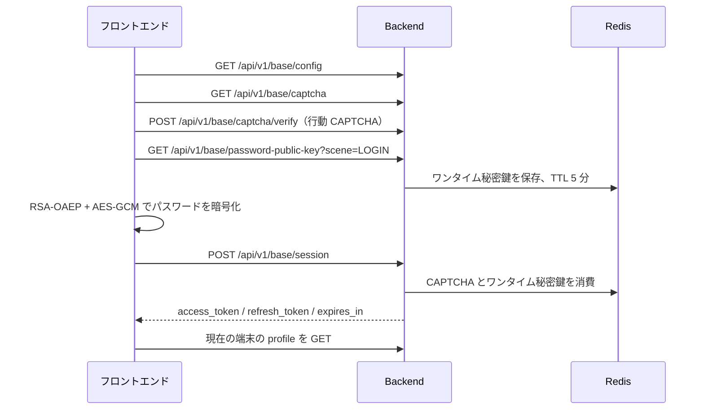

# ログインとパスワード暗号化

本書は、管理端末、uni-app、Taro が共通して使用するアカウントパスワード、CAPTCHA、OAuth、MFA、パスワード暗号文、Token の仕組みを説明します。インターフェースの正本は `backend/api/proto/base/v1/login.proto`、`oauth.proto`、`mfa.proto` です。

## アカウントとパスワードによるログイン



テナントコードがない場合、バックエンドは既定テナントを使用します。アカウントは `tenant_code + user_name` で検索し、独立した `phone` フィールドによるログイン分岐はありません。

通常の CAPTCHA は `captcha_id` とユーザーの回答を直接送信します。スライダー、クリック、回転などの行動 CAPTCHA は先に `/api/v1/base/captcha/verify` を呼び、有効期間 2 分のワンタイム `captcha_token` を取得します。その後、ログインの `captcha_code` として token を送信します。

## パスワードプロトコル

アルゴリズム識別子は次のとおりです。

```text
RSA-OAEP-256+A256GCM
```

1. 指定シーンのワンタイム RSA 公開鍵をリクエストします。
2. フロントエンドはパスワードに `trim()` を適用し、32 バイトの AES-256 キーと 12 バイトの GCM IV を生成します。
3. AES-GCM でパスワードを暗号化し、RSA-OAEP(SHA-256) で AES キーを暗号化します。
4. Base64 エンコード後、`key_id`、`nonce`、`algorithm`、`encrypted_key`、`iv`、`ciphertext` を送信します。
5. バックエンドはシーン、nonce、アルゴリズムを検証し、Redis から秘密鍵を読み取って直ちに削除します。復号後、`go-utils/crypto.Verify` でデータベースのパスワードハッシュと照合します。

ワンタイムキーの TTL は 5 分で、読み取り後に削除します。同じ暗号文は再利用できません。失敗時の再試行では、公開鍵を再取得して再暗号化する必要があります。

管理端末と 2 つのアプリ端末は、安全なコンテキストでは Web Crypto を優先します。H5 が HTTP で動作する場合、または Web Crypto がない実行環境では、各基盤が静的に読み込む `asmcrypto.js` で同じ RSA-OAEP(SHA-256) + AES-GCM プロトコルを実装します。uni-app の WeChat ミニプログラムは引き続き `wx.getRandomValues` と WeChat の Base64 API を使用し、ミニプログラム環境での動的 import 互換性問題を避けます。

純粋な JavaScript フォールバックは Web Crypto がないブラウザの実行互換性だけを解決し、HTTPS の代わりにはなりません。HTTP では通信を改ざんされる可能性があり、ログインレスポンスの access/refresh token も盗聴される可能性があります。本番環境と管理外ネットワークでは必ず HTTPS を使用してください。

## WeChat ミニプログラム OAuth

アプリ端末の `MP-WEIXIN` は `wechatmini` provider を使用します。

1. `wx.login()` でワンタイム code を取得し、`/api/v1/base/oauth/session` に送信します。
2. バインド済みの場合、バックエンドは MFA ポリシーに従って認証結果を返します。自動登録が許可され、未バインドの場合はユーザーを作成して認証を続行します。
3. 未バインドかつ自動登録が許可されていない場合は `binding_required=true` を返し、テナント、ユーザー名、パスワード、数字 CAPTCHA を表示します。
4. バインドフォームの送信時は必ず `wx.login()` を再度呼び出し、`/api/v1/base/oauth/binding/session` をリクエストします。バックエンドは CAPTCHA、アカウントパスワード、新しい code を検証してから、トランザクション内でバインドを保存し、ログイン認証状態を生成します。同じユーザーと WeChat アカウントの再送信は冪等ですが、別ユーザーにバインド済みの場合は拒否します。

WeChat code は一度しか使用できません。バインド状態の確認と正式なバインドで同じ code を再利用しないでください。

バインド API のレスポンスは引き続き `LoginStatus` に従い、バインド関係を書き込んだだけで MFA をスキップしません。

- `AUTHENTICATED`: access/refresh token を保存し、profile を読み込み、元のページへ移動します。
- `MFA_REQUIRED`: 一時 token は保存せず、TOTP、WebAuthn、復旧コードで `/api/v1/base/mfa/verify` を呼びます。成功後に正式 token を保存して元のページへ移動します。
- `MFA_ENROLLMENT_REQUIRED`: 正式 token は発行せず、`mfa_setup_ticket` で `/api/v1/base/mfa/enrollment` を呼び、バインドパラメータを取得します。その後 `/api/v1/base/mfa/enrollment/confirm` で因子を登録し、復旧コードを一度だけ表示します。WeChat ミニプログラムは再度 `wx.login()` を実行して `MFA_REQUIRED` へ進み、因子検証が完了して初めてログイン完了となります。

バインドリクエストが失敗した場合、バインド関係は保存されません。CAPTCHA、パスワード、MFA 設定を修正して安全に再試行でき、「WeChat アカウントが既にバインド済み」という残存状態に阻害されません。

管理端末は OAuth provider 一覧、認可リダイレクト、コールバック、バインド一覧、解除にも対応します。具体的な provider は `backend/configs/oauth*.yaml` で設定します。

## Token

ログインレスポンスには `token_type`、`access_token`、`refresh_token`、`expires_in` が含まれます。HTTP リクエストは `kratos_refresh_token` HttpOnly Cookie と、機密情報を含まない有効期限表示用の `kratos_refresh_exp` Cookie を同時に設定します。管理端末は access token とユーザー情報だけを永続化し、更新時は Cookie を優先します。uni-app/Taro は引き続きレスポンスボディの refresh token を読み取れるため、プラットフォームの安全なストレージを使用してください。

アプリ端末のリクエスト層は access token の残り時間が 5 分以下になると `POST /api/v1/base/token` を呼び出し、同時更新は同じ Promise を共有します。リクエストボディの `refresh_token` は省略でき、サーバーは HttpOnly Cookie から読み取って refresh token をローテーションします。更新に失敗するとローカルのログイン状態を消去します。ログアウト時は access/refresh token、Cookie、refresh token に対応するキャッシュ認証情報を削除します。

管理端末でユーザーを無効化・削除した場合、パスワードをリセットした場合、またはユーザーとロールの関係を変更した場合、バックエンドはそのユーザーの既存 access/refresh token を失効させ、古い認証情報でのアクセスを防ぎます。

バックエンドでのユーザー作成、リセット、個人パスワード変更は、現在有効な `BaseLoginPolicy` に従って検証します。パスワードなしでユーザーを作成した場合は、該当ポリシーの初期パスワードハッシュを使用します。そのユーザーのログイン状態は `PASSWORD_CHANGE_REQUIRED` となり、先にパスワードを変更する必要があります。初期パスワードはハッシュ形式だけで保存し、ポリシー詳細から元の値を返しません。

共通認証リクエストは `authMode: "none"` または同等設定を使用し、古い `Authorization` を付けません。ログインが必要なリクエストには自動的に Token を追加します。

## 多要素認証

管理端末とアプリ端末のシステム設定 `securityMfaMethod` は `totp` または `webauthn` を選択し、`securityMfaPolicy` は `disabled`、`optional`、`all_required` を選択します。実行時パラメータは `backend/configs/mfa.yaml` または `mfa.dev.yaml` の `mfa` ノードから読み込みます。TOTP のバインドには `encryption_key`（Base64 形式の 32 バイトキー）が必要です。TOTP は Authenticator のワンタイムパスワードと復旧コードを使用します。無効化時は現在のパスワードとワンタイムパスワードまたは復旧コードを検証します。WebAuthn はブラウザの Passkey またはセキュリティキーで登録・ログイン ceremony を行います。無効化時は現在のパスワードと Passkey または復旧コードを検証します。サーバーは Redis に短期 challenge を保存し、`base_user_mfa_webauthn` に資格情報の公開鍵と署名カウンターを保存します。本番環境では KMS、Vault、Secret Manager で設定を管理し、再起動後も同じ暗号化キーを使用してください。

管理端末とアプリ端末で同名のポリシーと認証方式が異なる場合は、より厳しい値を適用します。偽造可能な `source-client` リクエストヘッダーで管理端末やアプリ端末のセキュリティ要件を下げないためです。`disabled`、`optional`、`all_required` は、それぞれ MFA 不要、バインドは任意だがログイン時に検証、未バインドユーザーはログイン後に必ずバインド、を意味します。WeChat ミニプログラムが WebAuthn に対応しない場合、バインド済みユーザーはワンタイム復旧コードでログインできます。WebAuthn のバインドは Passkey をサポートする端末で完了してください。MFA の有効化・無効化は既存セッションを失効させ、TOTP 復旧コードは生成後に一度だけ表示します。

## 主要な入口

| 分野 | パス |
| --- | --- |
| Login Proto | `backend/api/proto/base/v1/login.proto` |
| OAuth Proto | `backend/api/proto/base/v1/oauth.proto` |
| MFA Proto | `backend/api/proto/base/v1/mfa.proto` |
| Backend Login | `backend/internal/biz/base/login.go` |
| Backend OAuth | `backend/internal/biz/base/oauth.go` |
| Backend MFA | `backend/internal/biz/base/mfa.go`、`backend/internal/service/base/v1/mfa.go` |
| キー生成と復号 | `backend/internal/biz/base/utils/password_crypto.go` |
| 管理端末のパスワード暗号化 | `frontend/admin/packages/core/src/utils/passwordCrypto.ts` |
| 管理端末 WebAuthn | `frontend/admin/packages/core/src/utils/webauthn.ts`、`frontend/admin/packages/modules/system/src/views/profile/components/security.vue` |
| uni-app ログインとパスワード暗号化 | `frontend/uni-app/packages/core/src/views/pages/login/login.vue`、`frontend/uni-app/packages/core/src/utils/passwordCrypto.ts` |
| uni-app WebAuthn | `frontend/uni-app/packages/core/src/utils/webauthn.ts` |
| Taro ログインとパスワード暗号化 | `frontend/taro-app/packages/core/src/views/pages/login/login.tsx`、`frontend/taro-app/packages/core/src/utils/passwordCrypto.ts` |
| Taro WebAuthn | `frontend/taro-app/packages/core/src/utils/webauthn.ts` |
| アプリ端末の Token とリクエスト | 2 つのアプリ端末の `packages/core/src/utils/auth.ts`、`http.ts` |

ログイン失敗を調査するときは、設定、CAPTCHA、公開鍵、暗号文シーン、ログインレスポンス、Token 保存、profile リクエストの順に確認します。平文パスワード、秘密鍵、完全な Token、CAPTCHA の回答をログやドキュメントに記録しないでください。
