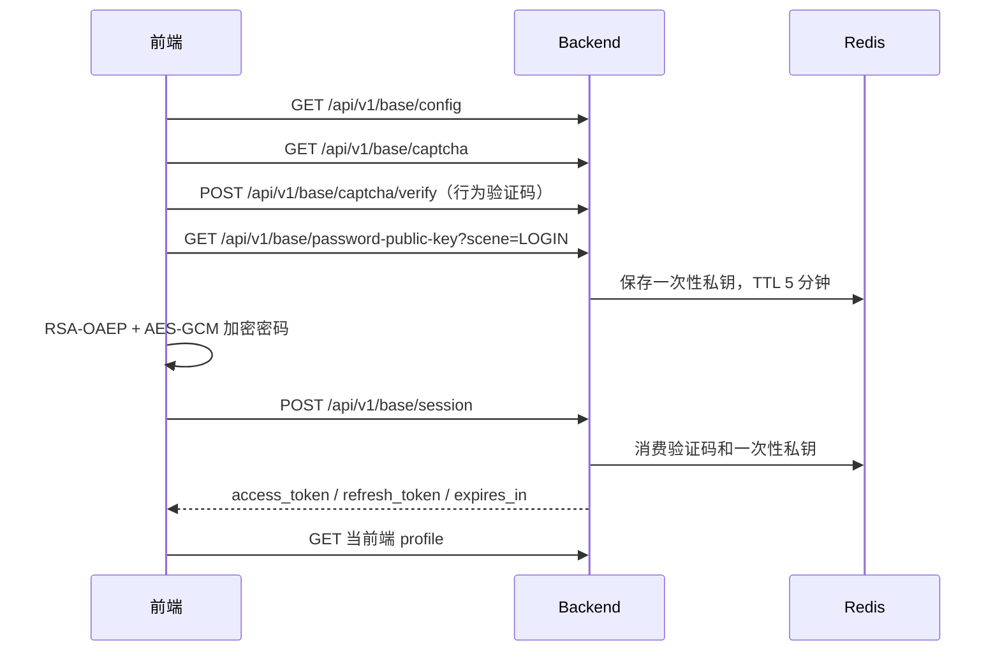

# 登录与密码加密

本文记录管理端、uni-app 和 Taro 当前共用的账号密码、验证码、OAuth、MFA、密码密文和 Token 机制。接口以 `backend/api/proto/base/v1/login.proto`、`oauth.proto`、`mfa.proto` 为准。

## 账号密码登录



未传租户编码时后端使用默认租户。账号按 `tenant_code + user_name` 查询；当前没有按独立 `phone` 字段登录的分支。

普通验证码把 `captcha_id` 和用户答案直接提交。滑块、点击、旋转等行为验证码先调用 `/api/v1/base/captcha/verify`，得到有效期 2 分钟的一次性 `captcha_token`，再把 token 作为登录的 `captcha_code` 提交。

## 密码协议

算法标识：

```text
RSA-OAEP-256+A256GCM
```

1. 前端请求指定场景的一次性 RSA 公钥。
2. 前端对密码执行 `trim()`，生成 32 字节 AES-256 密钥和 12 字节 GCM IV。
3. AES-GCM 加密密码，RSA-OAEP(SHA-256) 加密 AES 密钥。
4. Base64 编码后提交 `key_id`、`nonce`、`algorithm`、`encrypted_key`、`iv`、`ciphertext`。
5. 后端校验场景、nonce 和算法，从 Redis 读取并立即删除私钥，解密后用 `go-utils/crypto.Verify` 对比数据库密码哈希。

一次性密钥 TTL 为 5 分钟，读取后即删除。同一密文不能重放；失败重试必须重新取公钥并加密。

管理端和两个应用端在安全上下文中优先使用 Web Crypto；H5 通过 HTTP 访问或运行环境没有 Web Crypto 时，使用各自底座静态引入的 `asmcrypto.js` 实现相同的 RSA-OAEP(SHA-256) + AES-GCM 协议。uni-app 微信小程序继续使用 `wx.getRandomValues` 和微信 Base64 API，避免小程序环境的动态 import 兼容问题。

纯 JavaScript 回退只解决浏览器缺少 Web Crypto 时的运行兼容性，不等价于 HTTPS：HTTP 仍可能被主动篡改，登录响应中的 access/refresh token 也可能被网络监听者获取。生产环境和非受控网络仍必须使用 HTTPS。

## 微信小程序 OAuth

应用端 `MP-WEIXIN` 使用 provider `wechatmini`：

1. `wx.login()` 获取一次性 code，提交 `/api/v1/base/oauth/session`。
2. 已绑定时后端按 MFA 策略返回认证结果；允许自动注册且未绑定时先创建用户并继续认证。
3. 未绑定且不允许自动注册时返回 `binding_required=true`，页面展示租户、用户名、密码和数字验证码。
4. 用户提交绑定表单时必须重新调用 `wx.login()`，再请求 `/api/v1/base/oauth/binding/session`；后端先校验验证码、账号密码和新 code，再在事务内写入绑定并生成登录认证状态。重复提交同一用户同一微信号是幂等的，已被其他用户绑定则拒绝。

微信 code 只能使用一次，探测绑定状态和正式绑定不能复用同一个 code。

绑定接口的响应继续遵循 `LoginStatus`，不会因为“写入了绑定关系”就直接跳过 MFA：

- `AUTHENTICATED`：保存 access/refresh token，加载 profile，进入原目标页面。
- `MFA_REQUIRED`：不保存临时令牌，使用 TOTP、WebAuthn 或恢复码调用 `/api/v1/base/mfa/verify`；验证成功后保存正式令牌并进入原目标页面。
- `MFA_ENROLLMENT_REQUIRED`：不签发正式令牌，使用 `mfa_setup_ticket` 调用 `/api/v1/base/mfa/enrollment` 获取绑定参数，再调用 `/api/v1/base/mfa/enrollment/confirm` 完成因子绑定并仅展示一次恢复码。微信小程序随后重新走一次 `wx.login()`，进入 `MFA_REQUIRED`，用户完成因子校验后才算登录完成。

如果绑定请求返回错误，绑定关系不会落库；这样修复验证码、密码或 MFA 配置后可以安全重试，不会被遗留的“微信账号已绑定”状态阻塞。

管理端还支持 OAuth provider 列表、授权跳转、回调、绑定列表和解绑；具体 provider 由 `backend/configs/oauth*.yaml` 配置。

## Token

登录响应包含 `token_type`、`access_token`、`refresh_token` 和 `expires_in`。HTTP 请求同时设置 `kratos_access_token`、`kratos_refresh_token` 两个 HttpOnly Cookie，以及不含敏感信息的 `kratos_refresh_exp` 过期提示 Cookie。`kratos_access_token` 使用根路径，供 `/data/...` 图片、音视频和文件等原生 `src` 请求自动携带登录态；API 仍优先使用 `Authorization` 请求头。管理端只持久化访问令牌和用户信息，刷新时优先使用 Refresh Token Cookie。uni-app/Taro 仍可读取响应体中的 refresh token，并应使用平台安全存储。

应用端请求层在 access token 剩余不超过 5 分钟时调用 `POST /api/v1/base/token`，并发刷新共用同一个 Promise。请求体可以省略 `refresh_token`，服务端会从 HttpOnly Cookie 读取并轮换 refresh token；刷新成功会同步更新访问令牌 Cookie，保证原生 `src` 在令牌轮换后继续可用。刷新失败会清理本地登录态；登出会删除 access/refresh token、三个认证 Cookie 及 refresh token 对应的缓存认证信息。

管理端禁用、删除用户，重置密码或调整用户角色关系后，后端会撤销该用户现有 access/refresh token，避免旧认证载荷继续访问。

后台用户创建、重置和个人修改密码统一按当前生效的 `BaseLoginPolicy` 校验。创建用户未提交密码时，后端使用匹配策略中的初始化密码哈希；该用户登录响应为 `PASSWORD_CHANGE_REQUIRED`，必须先修改密码。初始化密码只以哈希形式保存，策略详情不会回传原值。

公共认证请求使用 `authMode: "none"` 或等价配置，不携带旧 `Authorization`；需要登录的请求自动添加 Token。

## 多因素认证

管理端和应用端的系统配置 `securityMfaMethod` 选择 `totp` 或 `webauthn`，`securityMfaPolicy` 选择 `disabled`、`optional` 或 `all_required`。运行时参数通过 `backend/configs/mfa.yaml` 或 `mfa.dev.yaml` 的 `mfa` 节点加载，其中 TOTP 绑定必须配置 `encryption_key`（base64 编码的 32 字节密钥）。TOTP 使用 Authenticator 动态口令和一次性恢复码，禁用时验证当前密码和动态口令或恢复码；WebAuthn 使用浏览器 Passkey 或安全密钥完成注册与登录 ceremony，禁用时验证当前密码和一次 Passkey 或恢复码，服务端在 Redis 保存短期 challenge，并在 `base_user_mfa_webauthn` 保存凭据公钥和签名计数器。生产环境应通过 KMS、Vault 或 Secret Manager 管理该配置，并在重启时保持同一加密密钥。

管理端与应用端的同名策略和认证方式按更严格值生效，避免通过可伪造的 `source-client` 请求头降低管理员或应用端的安全要求。`disabled`、`optional` 和 `all_required` 的语义分别为不要求 MFA、可选绑定并在登录时验证、未绑定用户登录后必须进入绑定流程。微信小程序不支持 WebAuthn 时，已绑定用户可使用一次性恢复码登录；WebAuthn 绑定需要在支持 Passkey 的客户端完成。启用或停用 MFA 会撤销该用户已有会话；TOTP 恢复码只在生成后显示一次。

## 关键入口

| 领域 | 路径 |
| --- | --- |
| 登录 Proto | `backend/api/proto/base/v1/login.proto` |
| OAuth Proto | `backend/api/proto/base/v1/oauth.proto` |
| MFA Proto | `backend/api/proto/base/v1/mfa.proto` |
| 后端登录 | `backend/internal/biz/base/login.go` |
| 后端 OAuth | `backend/internal/biz/base/oauth.go` |
| 后端 MFA | `backend/internal/biz/base/mfa.go`、`backend/internal/service/base/v1/mfa.go` |
| 密钥生成和解密 | `backend/internal/biz/base/utils/password_crypto.go` |
| 管理端密码加密 | `frontend/admin/packages/core/src/utils/passwordCrypto.ts` |
| 管理端 WebAuthn | `frontend/admin/packages/core/src/utils/webauthn.ts`、`frontend/admin/packages/modules/system/src/views/profile/components/security.vue` |
| uni-app 登录与密码加密 | `frontend/uni-app/packages/core/src/views/pages/login/login.vue`、`frontend/uni-app/packages/core/src/utils/passwordCrypto.ts` |
| uni-app WebAuthn | `frontend/uni-app/packages/core/src/utils/webauthn.ts` |
| Taro 登录与密码加密 | `frontend/taro-app/packages/core/src/views/pages/login/login.tsx`、`frontend/taro-app/packages/core/src/utils/passwordCrypto.ts` |
| Taro WebAuthn | `frontend/taro-app/packages/core/src/utils/webauthn.ts` |
| 应用端 Token 和请求 | 两个应用端各自的 `packages/core/src/utils/auth.ts`、`http.ts` |

排查登录失败时依次检查配置、验证码、公钥、密文场景、登录响应、Token 保存和 profile 请求。不要在日志或文档中记录明文密码、私钥、完整 Token 或验证码答案。
