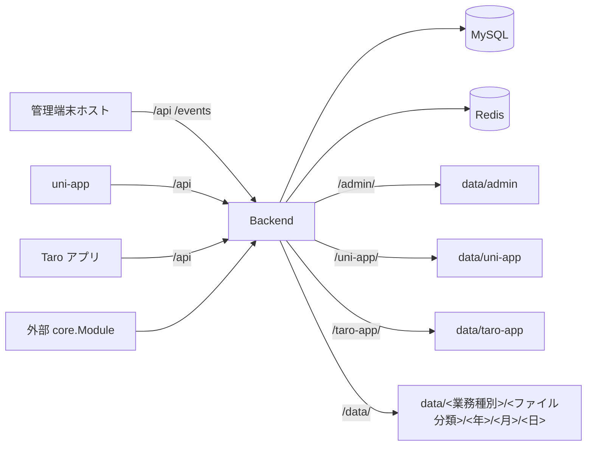

# システム全体設計

本書は、現在のリポジトリに存在するモジュール、実行関係、拡張境界だけを説明します。ドキュメント入口は [docs/README](README.md) です。具体的なコマンドは各モジュールの README と Makefile に従います。

## モジュール

| モジュール | 責務 | 生成物 |
| --- | --- | --- |
| `backend` | Kratos HTTP/gRPC、認証・権限、MFA、オープン認可クライアント、システム業務、AI、タスク、マイグレーション、静的リソース | Go サービス、OpenAPI |
| `kratos-core` | 業務 Proto を含まない再利用可能な Kratos ホストランタイム | 独立 Go module |
| `frontend/admin/packages/core` | 管理端末の起動、ログイン、MFA 検証、動的ルート、レイアウト、状態、共通コンポーネント | `@liujitcn/kratos-admin-core` |
| `frontend/admin/packages/modules/system` | システム管理、個人センター、セキュリティ設定、AI、オープン認可クライアント、開発ツール画面 | `@liujitcn/kratos-admin-system` |
| `frontend/admin/packages/cli` | 業務管理端末 workspace の作成 | `@liujitcn/kratos-admin-cli` |
| `frontend/admin/apps/admin` | core と System を組み合わせる既定の管理端末ホスト | 非公開 `@liujitcn/kratos-admin`、`backend/data/admin` |
| `frontend/uni-app` | ホーム、ログイン、マイページ、プロフィール、設定、WebView、AI の uni-app 端末 | `@liujitcn/kratos-uni-app`、`backend/data/uni-app` |
| `frontend/taro-app` | uni-app とバックエンド契約を共有する React/Taro 端末。H5 と WeChat ミニプログラムに対応 | `@liujitcn/kratos-taro-app`、`backend/data/taro-app` |
| `backend/migration` | バージョン管理されたデータベースと初期データ | 内蔵 SQL |

現在のリポジトリには、ショップ、注文、決済、推薦などの業務モジュールはありません。

## 実行関係



Backend は単独で実行でき、公開された `ProviderSet`、`NewModuleResources`、`NewModules`、`NewTasks`、`NewStreams`、`NewQueueConsumers` を通じて他の Core ホストへ接続できます。どちらの形態でも同じ Service、Biz、Repository を再利用します。プロセス内呼び出しは `Runtime.ClientConn()`、リモート呼び出しは標準 gRPC 接続を使用します。

## バックエンドの層分け

```text
api/proto
  -> api/gen/go
  -> internal/service/{base/v1,system/admin/v1,system/app/v1}
  -> internal/biz/{base,system/admin,system/app,...}
  -> internal/data/gen
```

- Proto は HTTP、gRPC、検証、フロントエンド型の唯一の契約ソースです。
- service は転送適合とエラーのフォールバックだけを担当し、業務ルールは biz、データベースアクセスは data に置きます。
- `internal/server/{base/v1,system/admin/v1,system/app/v1}` は転送サービスを登録します。`internal/module` は Admin と Core のモジュール適合と公開 Wire 合成ルートを担当し、`internal/cmd/server` は独立プロセスの起動入口を担当します。`bootstrap.go` は公開 ProviderSet により外部ホストの組み立て面を提供します。
- モジュール間のデータアクセスは生成クライアントだけを使用し、内部 Model、Query、Repository、Case は公開しません。

Core の `Module` は gRPC、HTTP、MCP を登録します。Core は `oss.root_directory` に基づき `/data/` のローカル OSS 静的マッピングも統一して登録します。任意の Contributor は middleware、バックグラウンド Server、OpenAPI、タスク、キューコンシューマー、SSE、起動スクリプト、起動フック、ヘルスチェック、静的リソースを提供できます。

## フロントエンドの境界

管理端末の依存方向は固定です。

```text
apps/admin -> packages/modules/system -> packages/core
```

業務モジュールは `AdminModule` を通じて、モジュール接頭辞付きのページ、静的ページ置換、トップツール、ユーザーメニュー、ルートオプション、名前空間拡張を提供します。既定ホストのモジュール一覧は `apps/admin/src/module-manifest.ts` だけで管理します。

アプリ端末は独立した pnpm workspace で、依存方向は次のとおりです。

```text
apps/uni-app -> packages/modules/system -> packages/core
```

`KratosAppModule` は `pages`、`views`、`icons` でページ、安定ビューキー、静的アイコンを宣言します。ホストが管理するのは `apps/uni-app/src/module-manifest.ts` だけです。core が公開する Vite プラグインはビルド時にモジュールページを走査し、`pages.json` と静的リソースを統合します。

Taro アプリ端末は独立した React/Taro workspace を使用します。

```text
apps/taro-app -> packages/modules/* -> packages/ui -> packages/core
```

`defineKratosTaroModule()` は実行時モジュールを宣言し、`defineKratosTaroBuildModule()` はビルド時のページ記述を提供します。`packages/core` の runner は開発・ビルド中にページ wrapper、分包設定、静的リソースを生成し、ホストは固定 bootstrap ページだけをコミットします。

## 契約と生成

| コマンド | 出力 |
| --- | --- |
| `make -C backend api` | `backend/api/gen/go` |
| `make -C backend openapi` | `backend/internal/openapi/assets/openapi.yaml` |
| `make i18n` | `openapi.yaml` と 3 言語の OpenAPI |
| `make -C frontend ts-admin` | 管理端末 core/System の `src/rpc` |
| `make -C frontend ts-uni-app` | uni-app core/system の `src/rpc` |
| `make -C frontend ts-taro-app` | Taro core/system の `src/rpc` |
| `make -C frontend ts` | 管理端末、uni-app、Taro の全 `src/rpc` |
| `make -C backend gorm-gen` | `backend/internal/data/gen` |
| `make -C backend wire` | `backend/internal/cmd/server/wire_gen.go` |

インターフェース変更は「Proto → 生成 → service/biz → フロントエンドのリクエストと画面 → マイグレーションと権限」の順で行います。生成ファイルは手作業で変更しません。

## データと権限

マイグレーションは `backend/migration/assets/v0.0.1/<database-type>/<data-source?>` に固定して管理します。MFA、オープン認可、その権限初期化は `v0.0.1` に直接記述します。新機能も同じ初期化バージョンを更新し、上位バージョンや増分マイグレーションは追加しません。起動時は設定に従って GORM 自動テーブル作成を行い、初期 SQL を実行し、最後に OpenAPI とメニューの関係から `base_api`、テナントロールのメニュー、Casbin ポリシーを同期します。

認証には JWT access/refresh token を使用します。パスワードはワンタイム RSA-OAEP + AES-GCM のハイブリッド暗号で送信し、テナントと権限の判定はサーバーを正とします。

## ドキュメント索引

| 主题 | ドキュメント |
| --- | --- |
| Backend と Core | [backend README](../backend/README.md)、独立した `kratos-core` リポジトリ |
| 管理端末 | [frontend/admin README](../frontend/admin/README.md) |
| アプリ端末 | [frontend/uni-app README](../frontend/uni-app/README.md) |
| Taro アプリ端末 | [frontend/taro-app README](../frontend/taro-app/README.md) |
| 新機能の接続 | [サービス統合ガイド](サービス接入指南.md) |
| データベース | [データベースと初期データ設計](数据库与初始化数据设计.md) |
| インターフェース検証 | [API パラメータ検証設計](接口参数校验设计.md) |
| ログイン | [ログインとパスワード暗号化](登录与密码加密流程.md) |
| AI | [AI アシスタント設計](AI助手设计.md) |
| アプリ内メッセージ | [アプリ内メッセージ設計](站内信设计.md) |
| 管理端末コンポーネント | [フロントエンドコンポーネント一覧](前端组件清单.md) |
| 国際化設計 | [国際化最終設計](国际化最终方案.md) |
| 新しい言語 | [国際化言語拡張ガイド](国际化语言扩展指南.md) |
