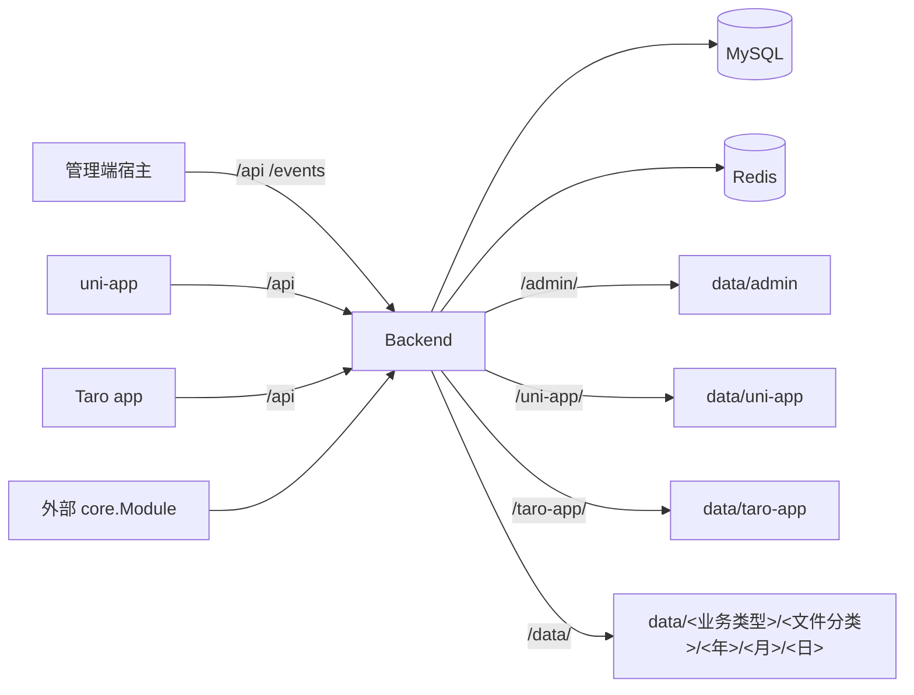

# 系统总体设计

本文只描述当前仓库已经存在的模块、运行关系和扩展边界。文档入口见 [docs/README](README.md)，具体命令以各模块 README 和 Makefile 为准。

## 模块

| 模块 | 职责 | 产物 |
| --- | --- | --- |
| `backend` | Kratos HTTP/gRPC 服务、认证权限、MFA、开放授权客户端、系统业务、AI、任务、迁移和静态托管。 | Go 服务、OpenAPI |
| `kratos-core` | 不含业务 Proto 的可复用 Kratos 宿主运行时。 | 独立 Go module |
| `frontend/admin/packages/core` | 管理端启动、登录、MFA 校验、动态路由、布局、状态和公共组件。 | `@liujitcn/kratos-admin-core` |
| `frontend/admin/packages/modules/system` | 系统管理、个人中心、安全设置、AI、开放授权客户端和开发工具页面。 | `@liujitcn/kratos-admin-system` |
| `frontend/admin/packages/cli` | 创建业务管理端 workspace。 | `@liujitcn/kratos-admin-cli` |
| `frontend/admin/apps/admin` | 组合 core 与 System 的默认管理端宿主。 | 私有包 `@liujitcn/kratos-admin`、`backend/data/admin` |
| `frontend/uni-app` | 首页、登录、我的、资料、设置、WebView 和 AI 的 uni-app 应用端。 | `@liujitcn/kratos-uni-app`、`backend/data/uni-app` |
| `frontend/taro-app` | 与 uni-app 共用后端契约的 React/Taro 应用端，支持 H5 和微信小程序。 | `@liujitcn/kratos-taro-app`、`backend/data/taro-app` |
| `backend/migration` | 版本化数据库和初始化数据。 | 内嵌 SQL |

仓库当前没有商城、订单、支付、推荐等业务模块。

## 运行关系



Backend 可独立运行，也可通过公开的 `ProviderSet`、`NewModuleResources`、`NewModules`、`NewTasks`、`NewStreams` 和 `NewQueueConsumers` 接入其他 Core 宿主。两种形态复用同一 Service、biz 和 Repository；进程内调用使用 `Runtime.ClientConn()`，远程调用使用标准 gRPC 连接。

## 后端分层

```text
api/proto
  -> api/gen/go
  -> internal/service/{base/v1,system/admin/v1,system/app/v1}
  -> internal/biz/{base,system/admin,system/app,...}
  -> internal/data/gen
```

- Proto 是 HTTP、gRPC、校验和前端类型的唯一契约源。
- service 只做传输适配和错误兜底，业务规则放 biz，数据库访问限制在 data。
- `internal/server/{base/v1,system/admin/v1,system/app/v1}` 注册传输服务；`internal/module` 负责 Admin 到 Core 的模块适配和公共 Wire 组合根，`internal/cmd/server` 负责独立进程启动入口，`bootstrap.go` 通过公开 ProviderSet 提供外部宿主装配门面。
- 跨模块数据访问只能使用生成客户端，不公开内部 Model、Query、Repository 或 Case。

Core 的 `Module` 负责 gRPC、HTTP、MCP 注册；Core 同时根据 `oss.root_directory` 统一注册 `/data/` 本地 OSS 静态映射。可选 Contributor 可提供中间件、后台 Server、OpenAPI、任务、队列消费者、SSE、启动脚本、启动钩子、健康检查和静态资源。

## 前端边界

管理端依赖方向固定为：

```text
apps/admin -> packages/modules/system -> packages/core
```

业务模块通过 `AdminModule` 提供带模块前缀的页面、静态页面替换、顶部工具、用户菜单、路由选项和命名扩展。默认宿主的模块清单只维护在 `apps/admin/src/module-manifest.ts`。

应用端是独立 pnpm workspace，依赖方向固定为：

```text
apps/uni-app -> packages/modules/system -> packages/core
```

`KratosAppModule` 通过 `pages`、`views` 和 `icons` 声明页面、稳定视图键与静态图标。宿主只维护 `apps/uni-app/src/module-manifest.ts`，core 公开的 Vite 插件在构建期扫描模块页面、合并 `pages.json` 和静态资源。

Taro 应用端使用独立的 React/Taro workspace，依赖方向为：

```text
apps/taro-app -> packages/modules/* -> packages/ui -> packages/core
```

`defineKratosTaroModule()` 声明运行时模块，`defineKratosTaroBuildModule()` 提供构建期页面描述；`packages/core` 的 runner 在开发或构建期间生成页面 wrapper、分包配置和静态资源，宿主只提交固定 bootstrap 页面。

## 契约和生成

| 命令 | 输出 |
| --- | --- |
| `make -C backend api` | `backend/api/gen/go` |
| `make -C backend openapi` | `backend/internal/openapi/assets/openapi.yaml` |
| `make i18n` | `backend/internal/openapi/assets/openapi.yaml`、`openapi.en-US.yaml`、`openapi.zh-TW.yaml`、`openapi.ja-JP.yaml` |
| `make -C frontend ts-admin` | 管理端 core 与 System 的 `src/rpc` |
| `make -C frontend ts-uni-app` | uni-app core 与 system 包的 `src/rpc` |
| `make -C frontend ts-taro-app` | Taro core 与 system 包的 `src/rpc` |
| `make -C frontend ts` | 一次生成管理端、uni-app 与 Taro 的全部 `src/rpc` |
| `make -C backend gorm-gen` | `backend/internal/data/gen` |
| `make -C backend wire` | `backend/internal/cmd/server/wire_gen.go` |

接口改动按“Proto → 生成 → service/biz → 前端请求与页面 → 迁移权限”完成。生成文件不手工修改。

## 数据和权限

迁移资源固定维护在 `backend/migration/assets/v0.0.1/<database-type>/<data-source?>`。MFA、开放授权及其权限初始化均直接写入 `v0.0.1`；新增功能也更新该初始化版本，不新增更高版本或增量迁移。启动时先按配置执行 GORM 自动建表，再执行初始化 SQL，最后从 OpenAPI 和菜单关系同步 `base_api`、租户角色菜单和 Casbin 策略。

认证使用 JWT access/refresh token；密码传输使用一次性 RSA-OAEP + AES-GCM 混合加密；租户和权限判断以服务端为准。

## 文档索引

| 主题 | 文档 |
| --- | --- |
| 后端和 Core | [backend README](../backend/README.md)、独立的 `kratos-core` 仓库 |
| 管理端 | [frontend/admin README](../frontend/admin/README.md) |
| 应用端 | [frontend/uni-app README](../frontend/uni-app/README.md) |
| Taro 应用端 | [frontend/taro-app README](../frontend/taro-app/README.md) |
| 新能力接入 | [服务接入指南](服务接入指南.md) |
| 数据库 | [数据库与初始化数据设计](数据库与初始化数据设计.md) |
| 接口校验 | [接口参数校验设计](接口参数校验设计.md) |
| 登录 | [登录与密码加密流程](登录与密码加密流程.md) |
| AI | [AI助手设计](AI助手设计.md) |
| 站内信 | [站内信设计](站内信设计.md) |
| 管理端组件 | [前端组件清单](前端组件清单.md) |
| 国际化设计 | [国际化最终方案](国际化最终方案.md) |
| 新增语言 | [国际化语言扩展指南](国际化语言扩展指南.md) |
